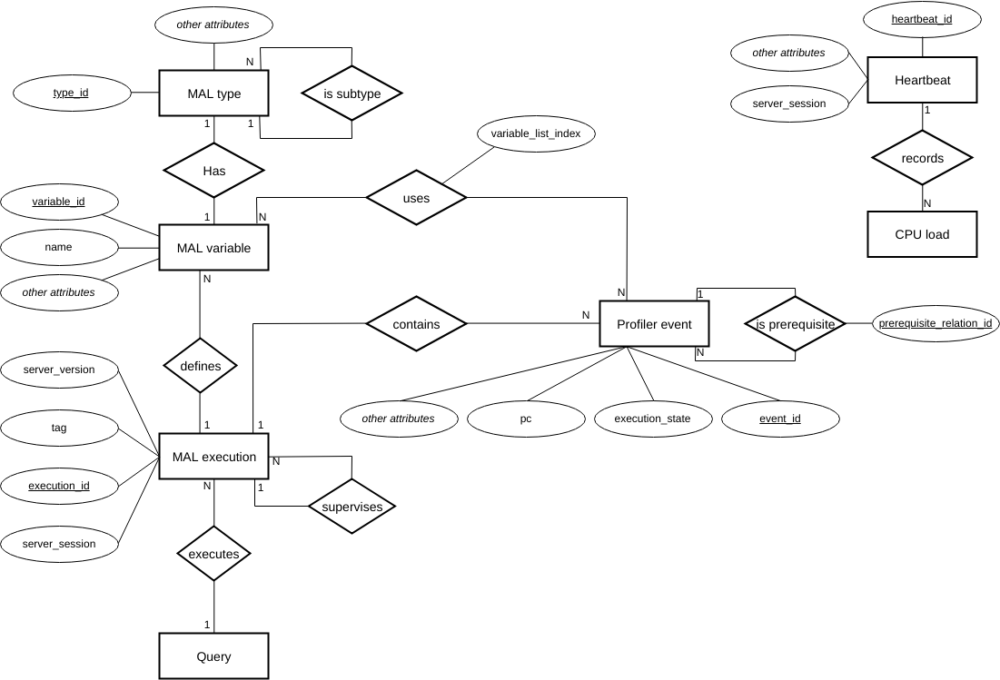

.. _internals:

Internals
=========

The *MAL Analytics* library is organized in two main classes:
``DatabaseManager`` and ``ProfilerParser``.

``ProfilerParser`` accepts a stream of JSON objects and parses them in
a form that can be inserted in the database. See :ref:data_structures
and :ref:database_schema. The public API
(:ref:mal_analytics.profiler_parser) of this class, consists of
methods for parsing JSON streams and handling parsed data.

``DatabaseManager`` is essentially a wrapper around a
`MonetDBLite-Python <https://github.com/MonetDB/MonetDBLite-Python>`_
connection. Because of constraints imposed by that package,
specifically the constraint that there can be only one connection to a
database at any one time, this class is a Singleton. This will
probably change in the future.

.. _database_schema:

Database Schema
^^^^^^^^^^^^^^^

The schema of the database was designed to capture a number of
interesting properties of the profiling information and to help answer
questions like: "What is the most expensive operation in this query?",
or "How well does the MonetDB server exploit the available cores?",
etc.

An E-R model of the schema is shown in the image below.

.. _database_manager:

Database Manager
^^^^^^^^^^^^^^^^

.. _profiler_parser:

Profiler Parser
^^^^^^^^^^^^^^^

.. _data_structures:

Data Structures
---------------

The internal representation of the profiler information is expressed using a
number of Python data structures that map more or less directly to the tables in
the database. These are:

- ``event`` This is a Python dictionary that holds metadata about individual
  instructions in a MAL plan. In fact the MonetDB server emits two such events
  for each instruction: one at the beginning of execution and one at the
  end. The dictionary has the following keys:

    ``session``
      The MonetDB server UUID.

      This field is *always* present.

    ``tag``
      An increasing number, different for each query in a specific server. The
      combination of `session` and `tag`, uniquely identifies a query.

      This field is *always* present.

    ``pc (program counter)``
      An increasing number, different for each instruction in the plan of a
      query. This field is *always* present.

    ``execution_state``
      Shows the execution state of the instruction. It takes the following
      values:

      - 0: start
      - 1: done
      - 2: pause

      This field is *always* present.

    ``relative_time``
      Number of microseconds since server startup.

      This field is *always* present.

    ``absolute_time``
      Number of microseconds since server UNIX epoch.

      This field is *always* present.

    ``thread``
      Which thread executed this instruction.

      This field is *always* present.

    ``mal_function``
      The name and the module of the function the current MAL
      instruction belongs to.

    ``usec``
      Estimated Time of Completion for the current
      instruction. (*Note*: This is mostly unused, at least by
      Marvin). The value is valid only for ``execution_state == 1``.

    ``rss``
      An estimation of the Resident Set Size (in Megabytes) at the
      current moment. (*Note*: This is mostly unused, and maybe should
      be removed from the traces?).  The value is valid only for
      ``execution_state == 1``.

    ``size``
      An estimation for the size (in Megabytes) this instruction
      created. The value is valid only for ``execution_state == 1``.

    ``long_statement``
      The full text of the executed instruction.

    ``short_statement``
      A short version of the text of the executed instruction.

    ``instruction``
      The name of the instruction. For example ``thetaselect``,
      ``append``, etc.

    ``mal_module``
      The name of the MAL module this instruction belongs to. For
      example ``algebra``, ``bat``, etc.

    ``version`` **(after Apr2019 version)**
      The version of the server that produced the profiling trace.

- ``variable``
    ``type_id``
        The database identifier of the type of the variable (see ...).

    ``name``
        The name of the variable.

    ``alias``
        (???)

    ``is_persistent``
        If the variable is persistent ``True`` or intermediate ``False``.

    ``bid``
        BAT ID(???).

    ``count``
        If the variable refers to a BAT, how many elements are in the BAT.

    ``size``
        The size of the type (???).

    ``seqbase``
        (???)

    ``hghbase``
        (???)

    ``eol``
        If `True` then the variable can be garbage collected.

    ``mal_value``
        If the variable is scalar, this is its value.

.. _error_codes:

Error codes
-----------

============= ====================================
Error code    Meaning
------------- ------------------------------------
W001          Ignoring object that contains errors
============= ====================================
